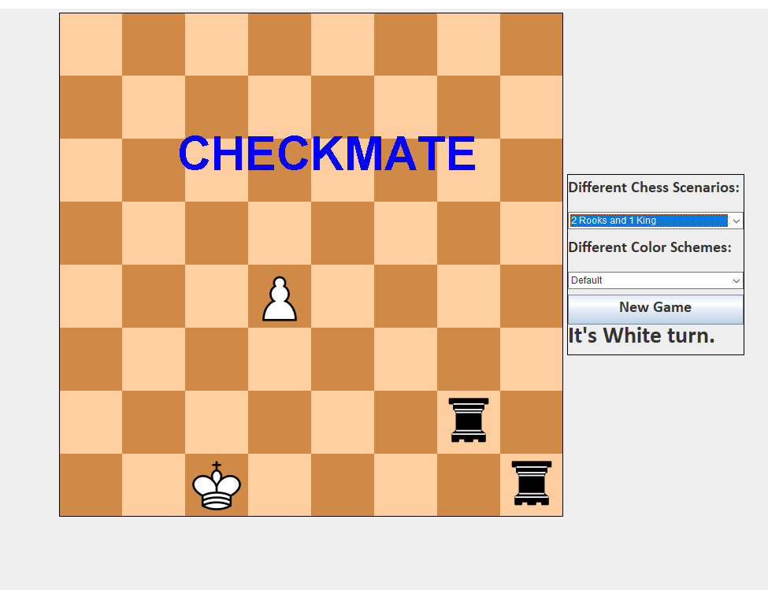

# Chess
> The Game Chess programmed in Java  
  

## Release History
*   1.0.0
    *   Release of first version
 
### Usage 🔌
1. Press the **Fork** button (top right the page) to save copy of this project on your account.

2. Download the repository files (project) from the download section or clone this project by typing in the bash the following command:

       git clone https://github.com/LuposX/Chess.git
3. Imported it in Intellij IDEA or any other Java IDE.
4. Run the application :D

## Meta

<!--Your Name – [@YourTwitter](https://twitter.com/dbader_org) – YourEmail@example.com-->

Distributed under the MIT license. See ``LICENSE`` for more information.

[LICENSE](https://github.com/LuposX/Chess/blob/dev/LICENSE)
